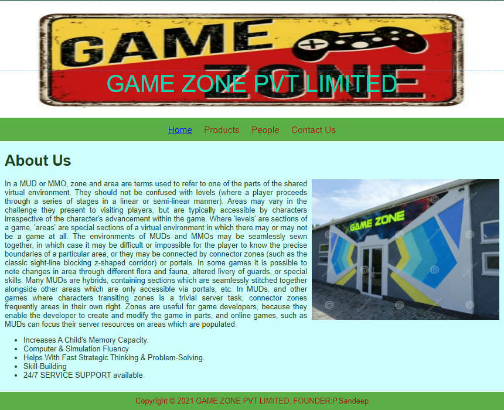
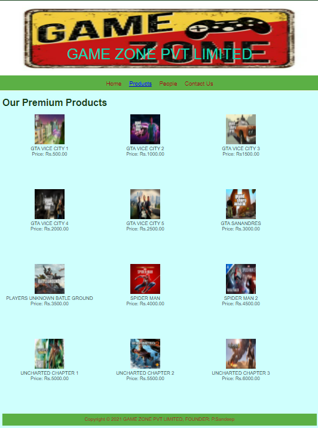
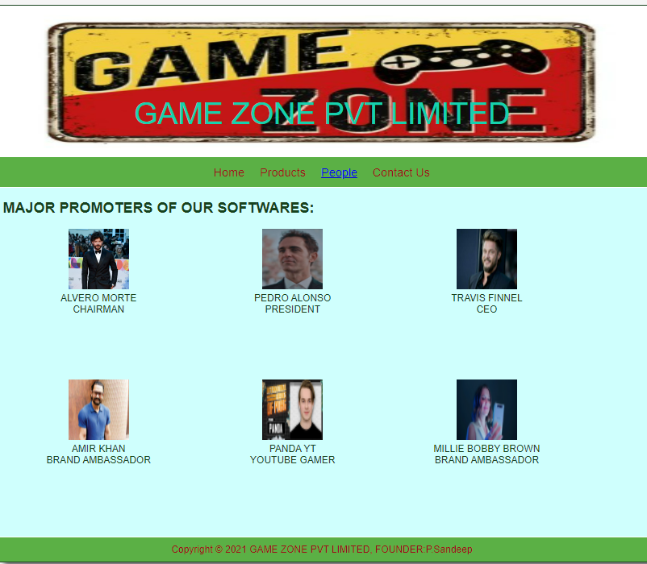
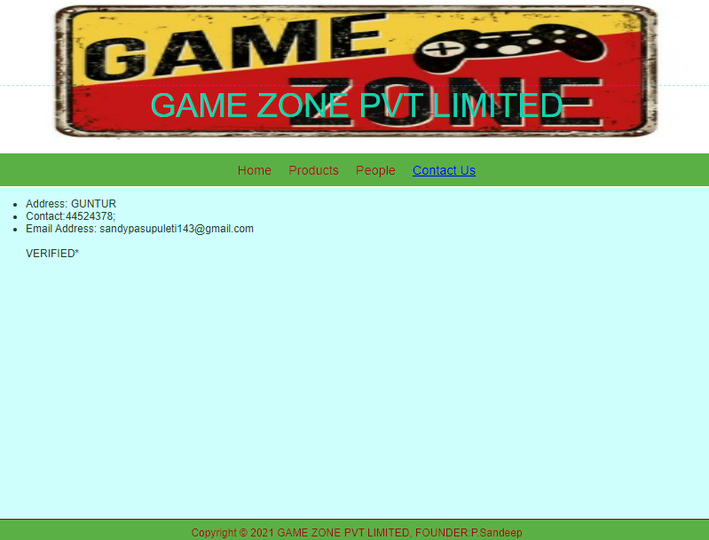

# Web Design for a Software Product Company

## AIM:

To design a static website for a software product company company.

## DESIGN STEPS:

### Step 1:

Requirement collection.

### Step 2:

Creating the layout using HTML and CSS.

### Step 3:

Updating the sample content.

### Step 4:

Choose the appropriate style and color scheme.

### Step 5:

Validate the layout in various browsers.

### Step 6:

Validate the HTML code.

### Step 6:

Publish the website in the given URL.

## PROGRAM :


### Homepage:
```
<!DOCTYPE html>
<html lang="en">
  <head>
    <title>GAME ZONE</title>
    <link rel="stylesheet" href="./css/layout.css" />
    <link rel="icon" href="./img/icon.png" type="image/x-icon" />
  </head>

  <body>
    <div class="container">
      <div class="banner">GAME ZONE PVT LIMITED</div>
      <div class="menu">
        <div class="menuitemselected"><a href="/static\home.html">Home</a></div>
        <div class="menuitem"><a href="/static\products.html">Products</a></div>
        <div class="menuitem"><a href="/static\people.html">People</a></div>
        <div class="menuitem"><a href="/static/contactus.html">Contact Us</a></div>
      </div>
      <div class="content">
        <div class="homecontent">
          <h1>About Us</h1>
          
          <div class="contenttext">
            In a MUD or MMO, zone and area are terms used to refer to one of the parts of the shared virtual environment.
They should not be confused with levels (where a player proceeds through a series of stages in a linear or semi-linear manner).
 Areas may vary in the challenge they present to visiting players, but are typically accessible by characters irrespective of 
 the character's advancement within the game. Where 'levels' are sections of a game, 'areas' are special sections of a virtual 
 environment in which there may or may not be a game at all.
The environments of MUDs and MMOs may be seamlessly sewn together, in which case it may be difficult or impossible for
 the player to know the precise boundaries of a particular area, or they may be connected by connector zones
  (such as the classic sight-line blocking z-shaped corridor) or portals. In some games it is possible to note changes
   in area through different flora and fauna, altered livery of guards, or special skills.
Many MUDs are hybrids, containing sections which are seamlessly stitched together alongside other areas which are only 
accessible via portals, etc. In MUDs, and other games where characters transiting zones is a trivial server task, connector
 zones frequently areas in their own right.
Zones are useful for game developers, because they enable the developer to create and modify the game in parts, and online games,
 such as MUDs can focus their server resources on areas which are populated.
            <ul>
              <li>Increases A Child's Memory Capacity.</li>
              <li>Computer & Simulation Fluency</li>
              <li>Helps With Fast Strategic Thinking & Problem-Solving.</li>
              <li>Skill-Building</li>
              <li>24/7 SERVICE SUPPORT available</li>
            </ul>
          </div>
        </div>
      </div>
      <div class="footer">
        Copyright &#169; 2021 GAME ZONE PVT LIMITED, FOUNDER:P.Sandeep
      </div>
    </div>
  </body>
</html>
```
### Products:
```
<!DOCTYPE html>
<html lang="en">
  <head>
    <title>GAME ZONE</title>
    <link rel="stylesheet" href="./css/layout.css" />
    <link rel="icon" href="./img/icon.png" type="image/x-icon" />
  </head>

  <body>
    <div class="container">
      <div class="banner">GAME ZONE PVT LIMITED</div>
      <div class="menu">
        <div class="menuitem"><a href="/static/home.html">Home</a></div>
        <div class="menuitemselected"><a href="/static/products.html">Products</a></div>
        <div class="menuitem"><a href="/static/people.html">People</a></div>
        <div class="menuitem"><a href="/static/contactus.html">Contact Us</a></div>
      </div>
      <div class="content">
        <div class="productcontent">    
          <h1>Our Premium Products</h1>
          <div class="productitems">
              <div class="productitem"> 
                  <div class="itemimage">
                  
                  </div>
                  <div class="itemname">GTA VICE CITY 1</div>
                  <div class="itemprice">Price: Rs.500.00 </div>
              </div>
              <div class="productitem"> 
                  <div class="itemimage">
                  
                  </div>
                  <div class="itemname">GTA VICE CITY 2</div>
                  <div class="itemprice">Price: Rs.1000.00 </div>
              </div>
              <div class="productitem"> 
                <div class="itemimage">
                
                </div>
                <div class="itemname">GTA VICE CITY 3</div>
                <div class="itemprice">Price: Rs1500.00 </div>
          </div>
          <div class="productitem"> 
            <div class="itemimage">
            
            </div>
            <div class="itemname">GTA VICE CITY 4</div>
            <div class="itemprice">Price: Rs.2000.00 </div>
          </div>  
          <div class="productitem"> 
            <div class="itemimage">
            
            </div>
            <div class="itemname">GTA VICE CITY 5</div>
            <div class="itemprice">Price: Rs.2500.00 </div>      
      </div>
      <div class="productitem"> 
        <div class="itemimage">
        
        </div>
        <div class="itemname">GTA SANANDRES</div>
        <div class="itemprice">Price: Rs.3000.00 </div>
        </div>
        <div class="productitem"> 
          <div class="itemimage">
          
          </div>
          <div class="itemname">PLAYERS UNKNOWN BATLE GROUND</div>
          <div class="itemprice">Price: Rs.3500.00 </div>
          </div>
          <div class="productitem"> 
            <div class="itemimage">
            
            </div>
            <div class="itemname">SPIDER MAN</div>
            <div class="itemprice">Price: Rs.4000.00 </div>
            </div>
            <div class="productitem"> 
              <div class="itemimage">
              
              </div>
              <div class="itemname">SPIDER MAN 2</div>
              <div class="itemprice">Price: Rs.4500.00 </div>
              </div>
              <div class="productitem"> 
                <div class="itemimage">
                
                </div>
                <div class="itemname">UNCHARTED CHAPTER 1</div>
                <div class="itemprice">Price: Rs.5000.00 </div>
                </div>
                  <div class="productitem"> 
                    <div class="itemimage">
                    
                    </div>
                    <div class="itemname">UNCHARTED CHAPTER 2</div>
                    <div class="itemprice">Price: Rs.5500.00 </div>
                    </div>
                    <div class="productitem"> 
                      <div class="itemimage">
                      
                      </div>
                      <div class="itemname">UNCHARTED CHAPTER 3</div>
                      <div class="itemprice">Price: Rs.6000.00 </div>
                      </div>
      <div class="footer">
        Copyright &#169; 2021 GAME ZONE PVT LIMITED, FOUNDER: P.Sandeep
      </div>
    </div>
  </body>
</html>
```
### People:
```
<!DOCTYPE html>
<html lang="en">
  <head>
    <title>GAME ZONE</title>
    <link rel="stylesheet" href="./css/layout.css" />
    <link rel="icon" href="./img/icon.png" type="image/x-icon" />
  </head>

  <body>
    <div class="container">
      <div class="banner">GAME ZONE PVT LIMITED</div>
      <div class="menu">
        <div class="menuitem"><a href="/static/home.html">Home</a></div>
        <div class="menuitem"><a href="/static/products.html">Products</a></div>
        <div class="menuitemselected"><a href="/static/people.html">People</a></div>
        <div class="menuitem"><a href="/static/contactus.html">Contact Us</a></div>
      </div>
      <div class="content">
        <div class="productcontent">    
            <h2>MAJOR PROMOTERS OF OUR SOFTWARES:</h2>
            <div class="productitems">
                <div class="productitem"> 
                    <div class="itemimage">
                    
                    </div>
                    <div class="itemname">ALVERO MORTE</div>
                    <div class="itemprice">CHAIRMAN</div>
                </div>
                <div class="productitem"> 
                    <div class="itemimage">
                    
                    </div>
                    <div class="itemname">PEDRO ALONSO</div>
                    <div class="itemprice">PRESIDENT</div>
                </div>
                <div class="productitem"> 
                    <div class="itemimage">
                    
                    </div>
                    <div class="itemname">TRAVIS FINNEL</div>
                    <div class="itemprice">CEO</div>
                </div>
                <div class="productitem"> 
                    <div class="itemimage">
                    
                    </div>
                    <div class="itemname">AMIR KHAN</div>
                    <div class="itemprice">BRAND AMBASSADOR</div>
                </div>
                <div class="productitem"> 
                    <div class="itemimage">
                    
                    </div>
                    <div class="itemname">PANDA YT</div>
                    <div class="itemprice">YOUTUBE GAMER</div>
                </div>
                <div class="productitem"> 
                    <div class="itemimage">
                    
                    </div>
                    <div class="itemname">MILLIE BOBBY BROWN</div>
                    <div class="itemprice">BRAND AMBASSADOR</div>
                </div>

          </div>
        </div>
      </div>
      <div class="footer">
        Copyright &#169; 2021 GAME ZONE PVT LIMITED, FOUNDER:P.Sandeep
      </div>
    </div>
  </body>
</html>
```
### Contactus:
```<!DOCTYPE html>
<html lang="en">
  <head>
    <title>GAME ZONE PVT LIMITED</title>
    <link rel="stylesheet" href="./css/layout.css" />
    <link rel="icon" href="./img/icon.png" type="image/x-icon" />
  </head>

  <body>
    <div class="container">
      <div class="banner">GAME ZONE PVT LIMITED</div>
      <div class="menu">
        <div class="menuitem"><a href="/static/home.html">Home</a></div>
        <div class="menuitem"><a href="/static/products.html">Products</a></div>
          <div class="menuitem"><a href="/static/people.html">People</a></div>
        <div class="menuitemselected"><a href="/static/contactus.html">Contact Us</a></div>
      </div>
      <div class="content">
          <ul>
              <li>Address: GUNTUR <br></li>
              <li>Contact:44524378;<br></li>
              <li>Email Address: sandypasupuleti143@gmail.com<br></li>
              <br>VERIFIED*
          </ul>    
        </div>
    </div>
    </div>
    </div>
    <div class="footer">
      Copyright &#169; 2021 GAME ZONE PVT LIMITED, FOUNDER:P.Sandeep
    </div>
  </div>
</body>
</html>
```
### layout:
```* {
  box-sizing: border-box;
  font-family: Arial, Helvetica, sans-serif;
}
body {
  background-color: whitesmoke;
  color: #17421d;
}
.container {
  width: 1080px;
  margin-left: auto;
  margin-right: auto;
  border-width: 1px 1px 1px 1px;
  border-style: solid;
  box-shadow: 15px 15px 8px gray;
}

.banner {
  display: block;
  width: 100%;
  height: 250px;
  text-align: center;
  font-size: 50px;
  background-image: url("/companywebsite/static/img/gamezone.png");
  background-size: 100% 100%;
  margin: 0px 0px 0px 0px;
  padding-top: 150px;
  color: #16d1ae;
}

.menu {
  display: block;
  width: 100%;
  height: 50px;
  font-size: larger;
  background-color: #5bb045;
  text-align: center;
  padding-top: 15px;
  margin: 0px 0px 0px 0px;
  border-width: 1px;
}

.menuitem {
  display: inline-block;
  margin-left: 10px;
  margin-right: 10px;
}
.menuitemselected {
  display: inline-block;
  margin-left: 10px;
  margin-right: 10px;
  color: #16d1ae;
}

.menuitem a {
  text-decoration: none;
  color: #9c1018;
}

.content {
  display: block;
  width: 100%;
  background-color: #cffffd;
  min-height: 500px;
  margin: 0px 0px 0px 0px;
  border-width: 1px;
  border-color: white;
  border-style: solid;
}
.homecontent {
  min-height: 500px;
  margin: 10px 10px 10px 10px;
}
.homecontent h1 {
  text-align: left;
}
.homecontent img {
  float: right;
  width: 400px;
  height: 300px;
  margin-left: 10px;
}

.contenttext {
  text-align: justify;
}

.productcontent {
  min-height: 500px;
  margin: 10px 10px 10px 10px;
}

.productcontent h1 {
  text-align: left;
}

.productitems {
  display: block;
}

.productitem {
  display: inline-block;
  width: 30%;
  height: 250px;
  text-align: center;
}

.productitem img {
  width: 100px;
  height: 100px;
  display: block;
}
.productitem .itemimage {
  display: block;
  margin-left: auto;
  margin-right: auto;
  width: 100px;
  margin-bottom: 5px;
}

.productitem .itemname {
  display: block;
}
.productitem .itemprice {
  display: block;
}

.footer {
  display: block;
  width: 100%;
  height: 40px;
  background-color: #5bb045;
  text-align: center;
  padding-top: 10px;
  margin: 0px 0px 0px 0px;
  color: #9c1018;
}
```

# Output:
## homepage:

## Products:

## People:

## Contactus:


## Result:

Thus a website is designed for the software product company and the HTML,CSS code are validated.
